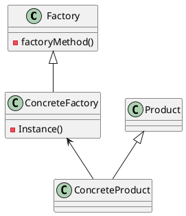

UML Diagram
===========

```plantuml
@startuml
Factory <|-- ConcreteFactory
Product <|-- ConcreteProduct
ConcreteFactory <-- ConcreteProduct


class Factory{
    - factoryMethod()
}

class ConcreteFactory {
    - Instance()
}

class Product{

}

class ConcreteProduct {

}
@enduml
```
